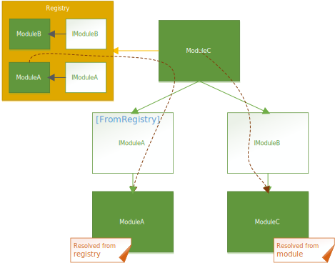
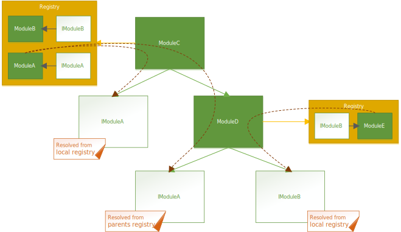

Module Trees
------------

### Submodules

There are two principal approaches to build up the module tree that will create the runtime tree of your application.
In both scenarios a module will use another module, which I will call a submodule.
From these submodules the module will inject components into components that itself declares.
That is how modules are connected in ModuleInject and how dependencies of components between different modules are resolved.

In and by itself this is a pretty simple setup. Take some components from a submodule and put them in some components that I create.
The interesting problem is now how to provide modules with submodules.

#### Direct resolution

The simplest approach is to declare a submodule as a private or public component of the module. 
That means the submodule is created by the module itself. 
No problem and no headache at all. 

    public class ParentModule : InjectionModule<...>, ...
    {
        private IComponent PublicComponent 
        { 
            get 
            {
                return GetSingleInstance<IComponent>(m => new Component() {
                    SomeSubComponent = m.SubModule.SubComponent
                });
            }
        }

        private ISubModule SubModule 
        { 
            get 
            {
                return GetSingleInstance<SubModule>();
            }
        }
    }

It only becomes a problem when you want to use the submodule in different parts of your application. In that situation you would have to distribute it over complex injection between modules. And you probably don't want that.

### Registry resolution

Another slightly more complicated approach to distribute submodules is the use of one or several registries.
A registry is a class that derives from `IRegistry`. It is used to register modules that can be resolved.
This is different to most other IoC containers where an interface/type and some string keys can be combined to 
register and resolve a type. A registry only offers the possibility to register a module via its interface.

    IRegistry registry = new Registry();
    registry.RegisterModule<ISubModule, SubModule>();

With this registry you could resolve the submodule in aboves `ParentModule` as follows:

    public class ParentModule : InjectionModule<...>, ...
    {
        private IComponent PublicComponent 
        { 
            get 
            {
                return GetSingleInstance<IComponent>(m => new Component() {
                    SomeSubComponent = m.SubModule.SubComponent
                });
            }
        }
    
        [FromRegistry]
        private ISubModule SubModule { get; private set; }
    }

For the registry to be available in the module we can do the following:

    ParentModule parentModule = new ParentModule();

    // from above
    parentModule.Registry = registry; 
    
    // now the registry will be used to resolve the submodule
    parentModule.Resolve(); 

### Example

The following image shows the difference between direct resolution and resolution from a registry.

### MEF Registries

To make the module resolution in registries less cumbersome or more flexible you can use a MEF registry.
These registries use MEF to load the modules that they distribute across your module tree.

The creation of such a registry is relatively simple. You derive from `MefRegistryBase` and do something like the following:

    public class MyMefRegistry : MefRegistryBase 
    {
        // imports a submodule which will be available 
        // in all modules that use the registry
        [Import]
        ISubModule SubModule { get; private set; }

        public MyMefRegistry() 
        {
             // you can add any type of MEF catalog you want
             // here we search for modules in the current assembly
             var catalog = new AssemblyCatalog(System.Reflection.Assembly.GetExecutingAssembly());
             this.AddCatalog(catalog);
        }
    }

Then apply the registry to a module and everything is done.

### Registry Merge

Registry are somewhat complex because they are handed down from a module to each of its submodules. This means that applying a registry on the root of a module tree will make the modules in the registry available to all modules in the tree.
In that way it is very simple to get common modules distributed over all your other modules.

This means in our examples above the `ISubModule` submodule in the `ParentModule` will also have access to the registry of its parent.

In most of the cases this is a very nice feature. In some cases however you want additional or different modules to be available in a subtree of your module tree. To enable this different registries can be applied to each module in the tree.
Whenever a registry is encountered in a module it is merged with the registry that was applied in the resolution of its parent module.

Note that types in the local registry of the module take priority over types in the parent registry. Also be warned that when a module which is placed in different subtrees with different registries, it will only be resolved once with the registry of the subtree it is resolved in first.

### Example

The following diagram should give you a rough overview of what happens.

In this example ModuleC holds a registry that has two modules registered. 

As ModuleC requires IModuleA, it resolves it from its own registry with an instance of ModuleA.

When ModuleD is resolved it will create a merged registry out of its own registry and the registry of ModuleC.
Because IModuleA is only registered in the registry of ModuleC it is taken from there. However IModuleB is registered in both registries. Therefore, the registry of ModuleD takes precedence and the requested IModuleB interface is filled with an instance of ModuleE.