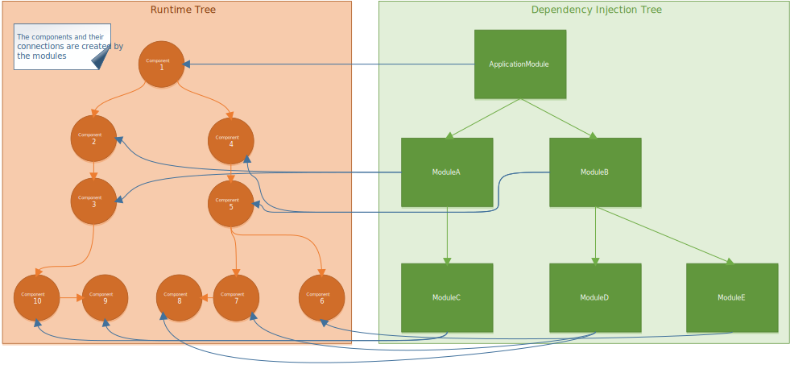

Tutorial
--------

### Modules & Components

In ModuleInject everything is centered around modules and components.

Components are the working units in your application, the classes that provide your functionality. I will call them the
runtime tree because they roughly make up a tree that represents your application during runtime.

On the other hand, modules are purely made to create and connect the components of your program. They can also divide
your application in logical sections. Because they are mostly used on application startup to create the runtime tree of
the application, I will call them the setup tree.

The following image shows an example of these two trees.

 They provide an interface that
other modules can rely on and initialize the components that are managed by them. The interface of a module is standard
C# interface with properties representing the components that the module should provide to other modules.

    public interface IMainModule : IModule
    {
        IPrintComponent PrintComponent { get; }
    }

This is how a very basic interface for module named `IMainModule` could look like. Other modules will consume this module
purely by working with this interface.

This gives you nice boundaries that won't be crossed so easily. Also notice that components are offered in the form of interfaces. This is also important because else you would reveal the inner workings of your module to other modules.

You can see that ModuleInject is all about contracting between different parts of your application and separating them clearly through these contracts. This also allows to exchange modules relatively easy when you see the need to do so.

### Your first module

#### The modules interface is its contract

Let's take a leap at implementing the module interface given above. First we define concrete class of our module:

    public class MainModule : InjectionModule<MainModule>, IMainModule
    {
        public IPrintComponent PrintComponent { get { ... } }
    }

Looks easy enough. You define the class MainModule which implements the interface IMainModule that we defined above. Additionally, it derives from the InjectionModule class which is generic and takes the type of the module itself. Also we need to implement the single public component that the module should offer (but not how it is done yet).

#### The modules first component

Obviously, there is no information yet how the component should look like and how it will be resolved. We will fix that just now by defining the interface of the component:

    public interface IPrintComponent
    {
        void PrintOutput();
    }

Can you imagine what it will do? So lets see how the first draft of our component should look like.

    public class PrintComponent : IPrintComponent
    {
        public void PrintOutput()
        {
            Console.WriteLine("Hello World");
        }
    }

#### Registering the component in the module

Finally, we have a component to print a Hello World greeting for us. But how do we employ it in the module? Well we do the following to register and return the component:

    public class MainModule : InjectionModule<MainModule>, IMainModule
    {
        public IPrintComponent PrintComponent 
        {
            get
            {
                return GetSingleInstance<PrintComponent>();   
            }
        }
    }

This registers the `PrintComponent` property of the MainModule to be a `PrintComponent` instance. Because we told the module that we only want a single instance we will only get back the same instance each time the `PrintComponent` is retrieved.

#### Resolving the module

On calling the Resolve method of the module several things are done which you can't understand at this moment (e.g. the registry is applied so that submodules retrieved from it are available for resolving dependencies). We will come to that later. After this we can use the module as follows to print our greeting:

    static void Main(string[] args)
    {
        IMainModule module = new MainModule();
        module.Resolve();

        IPrintComponent component = module.PrintComponent;

        component.PrintOutput();
    }

This will result in the following output: "Hello World" 

What happened is that in the first call to the getter for the Property `PrintComponent`of the MainModule the registration of the component was performed and at the same time it was resolved and returned. We used the returned instance to print the greeting.

#### Property injection and private components

So we have our first module up and running. But now lets make it a bit more complicated to show off some of the features of ModuleInject.

    public interface INameComponent
    {
        string NameToGreet { get; }
    }

    public class NameComponent
    {
        public string NameToGreet { get; set; }
    }      

    public class PrintComponent : IPrintComponent 
    {
        public INameComponent NameProvider { get; set; }

        public void PrintOutput() 
        {
            Console.WriteLine("Hello {0}", NameProvider.NameToGreet);
        }
    }

Basically, we make the greeting string configurable via dependency injection. With these components we extend our MainModule like this:

    public class MainModule : ...
    {
        // private component
        private INameComponent NameComponent 
        { 
            get
            {
                return GetSingleInstance(m => new NameComponent() {
                    NameToGreet = "ModuleInject"
                });
            } 
        }

        // public component
        public IPrintComponent PrintComponent 
        {
            get
            {
                return GetSingleInstance(m => new PrintComponent() {
                    NameProvider = m.NameComponent
                });   
            }
        }
    }

A lot of stuff just happened. The components are relatively straight forward. But in the registration process we now can see that there a two kinds of components in a module.

First the public components which are available through the interface of the module to other modules. And second the private components which are only available inside the module.

But for now let's concentrate on the registration process. As before we register both components and specify their actual implementations. But in addition we now inject values into properties of the components. This can be done in different ways. But here it is done with the simplest one using C#'s integrated object initializers. 

The argument `m` to the Func that will perform the construction of the component is the module itself (this usually leads to a better performance than using a closure with `this`). In this way you can access all components that are available inside the module. You can inject e.g. properties of the module, of submodules and constant values also. Therefore, `m.NameComponent` is the new component we created above. 

If we now execute our application (which we didn't need to change), we get the following output:

    "Hello ModuleInject"

#### Using submodules

Until now we only used one module. But with ModuleInject it is possible to create a hierarchy of modules that encapsulate the components of certain parts of your application.

Let's try and create a submodule for our current MainModule:

    public interface ILogModule : IModule
    {
        ILog Log { get; }
    }

    public class LogModule : InjectionModule<LogModule>, ILogModule
    {
        public ILog Log { get { return GetSingleInstance<DebugLog>(); } }
    }

This module is very simple and only defines a standard log component that can be used.
The logging component looks as follows:

    public interface ILog 
    {
        void Write(string message);
    }
                           
    public class DebugLog 
    {
        public void Write(string message) 
        {
            Debug.WriteLine(message);
        }
    }

So we now have a logging component that writes arbitrary messages to the default debug output. We also need to extend our print component somewhat:

    public class PrintComponent : IPrintComponent 
    {
                        ...  
        public ILog Log { get; set; }

        public void PrintOutput()
        {
            Log.Write("Before greeting");

            Console.WriteLine("Hello {0}", NameProvider.NameToGreet);

            Log.Write("After greeting");

        }
    }

The PrintComponent does now implement writing to a given `ILog` component before and after it outputs the greeting. This module can now be used in our MainModule like this:

    public MainModule() 
    {    
        ...

        private ILogModule LogModule { get { return SingleInstance<LogModule>(); } }
            
        ...

        public IPrintComponent PrintComponent 
        {
            get
            {
                return GetSingleInstance(m => new PrintComponent() {
                    NameProvider = m.NameComponent,
                    Log = m.LogModule.Log
                });   
            }
        }
    }

In the MainModule we first register the LogModule as a private component. This will assure it is filled with an instance of the proper `ILogModule` implementation.

Afterwards we inject the Log component of the LogModule into the `Log` property of the `PrintComponent`. In that way the `PrintComponent` uses the kind of logging we define in our `ILogModule` implementation.

Now our PrintComponent will produce log output on the debug stream and the complete output will look as follows:

    "Before greeting"
    "Hello ModuleInject"
    "After greeting"

#### Conclusion
     
Well, so far you saw how to write your first small modules. Yet, there are more topics that need to be covered before you can say you saw all of the features of ModuleInject, e.g.:

* Constructor injection
* Method injection
* Factory methods
* Injectors
* Interface interceptors

