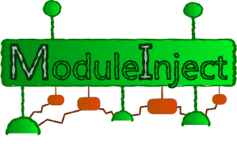

Welcome to the ModuleInject homepage.

This project aims at creating an IoC framework that is strongly typed, modular, explicit and provides a high degree of compiler support for detecting errors.

You should have a look at this project if one of the following points stroke you in the past:

* You did encounter the situation where the configuration of your application through an IoC container reached a high degree of complexity.
* You dislike the fact that most injection errors are found at runtime because of loose typing in the injection process.
* You noticed that with more than a few developers it is better to write out explicitly the construction process of your application and not hide it in default rules.
* You want to divide your application code in modules that fulfill certain contracts.

Most IoC Containers aim at providing a very high level of flexibility. In the first place this is good. But at some point in time the injection instructions for your application
can become unmanageable. This is when all the flexibility is hindering you to expand further. 

This is where this framework can come in to save the day. Here are some facts about it:

* Provides modules with fixed contracts via interfaces.
* No fancy auto-wiring of your classes, every injection must be stated.
* Provides compiler supports through the use of LINQ Lambda Expression.
* Supports property, constructor and method injection.
* Supports Unity interface interceptors.
* Supports injection into existing instances.
* Supports factory methods in modules.
* Supports injectors which encapsulate code for recurring initializations.
* Supports module detection via MEF.

See the full documentation on http://useurmind.github.io/ModuleInject for more details.

Also available via NuGet on:
	https://www.nuget.org/packages/ModuleInject/